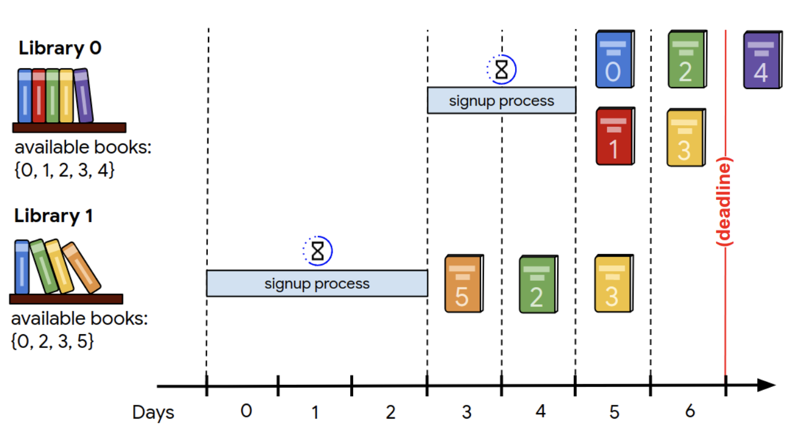
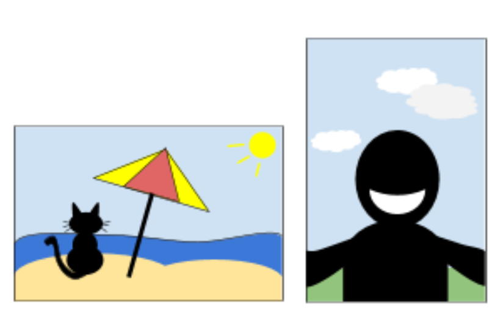
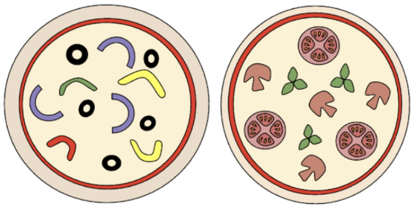

**Google Hashcode 2020 - Qualification Round**

<b>Problem:</b> Given a list of libraries and the books they contain, the goal is to choose which libraries should scan which books while maximizing the total score of books, while keeping in mind that a library has a signup time cost.

<b>Approach:</b> We implememted a simple heuristic where we sort the libraries by a score that expresses the importance of the books a library contains over it's speed to deliver value.

**Google Hashcode 2019 - Qualification Round**

<b>Problem:</b> Given a list of photos with tags that describe them, the goal is to find a permutation (i.e. put the photos side by side), so that the sequence is as interesting as possible.

<b>Approach:</b> We implemented a greedy local search that creates a permutation of slides by adding as next slide the one that maximizes the interest factor. Also the simulated annealing process was implemented as well.

**Google Hashcode 2021 - Practice Problem**

<b>Problem:</b> Given a list of pizzas with their ingredients, the goal is to deliver pizzas to teams such that the number of distinct ingredients is maximized across all teams.

<b>Approach:</b> For this problem	we implemented a <b>randomized</b> approach, along with a <b>heuristic</b> that expands a solution using <b>local search</b>.
